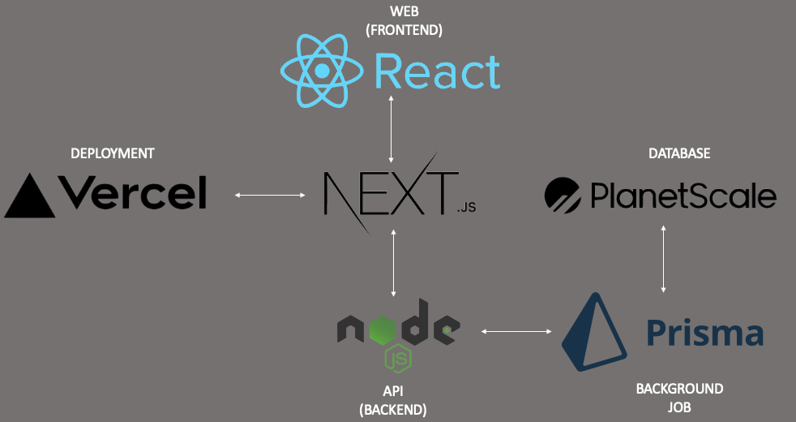

### Description
- Introspect serves as a mindfulness tool designed for aspiring leaders to contemplate the ethical implications of their actions. Our Technology and Innovation Ethics course at Notre Dame required us to develop a tool that would facilitate future leaders in assessing the morality of their conduct. Thus, we designed a web application, which presents users with ethical dilemmas to gauge their moral compass. The app employs an internal tool that evaluates the user's responses and assigns a score based on their philosophical inclination. At the end of the exercise, the users receive graphs and analytics that highlight their philosophical leanings and provide resources to help them understand their preferred branches better. We utilized Next.js, NextAuth, React, Node.js, PlanetScale, Prisma, and Vercel to create the application.
- Feel free to sign up and try it out!

### Technology Frameworks and Stack

### Link to site
- [Introspect](https://introspect-brown.vercel.app/)