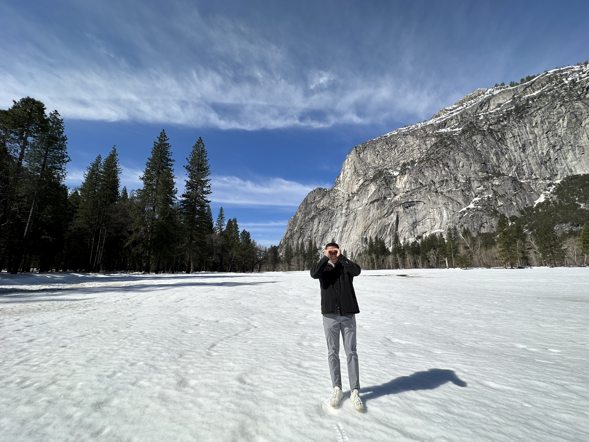
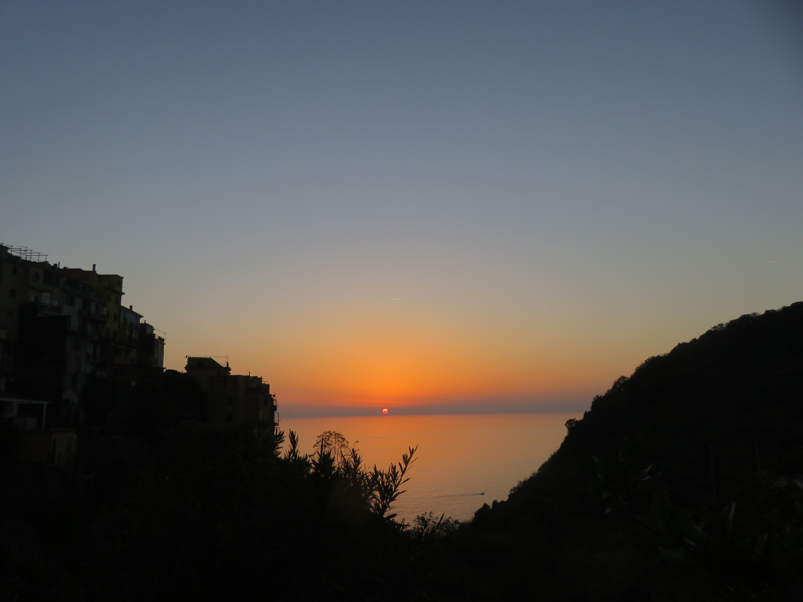

## Summer 2022
Summer 2022 brought a multitude of first-time experiences. I [studied abroad in Spain](https://engineering.nd.edu/departments-programs/study-abroad/spain-summer-engineering/), immersing myself in a new culture, while also venturing into the corporate realm as a tech consulting intern at [EY Chicago](https://www.ey.com/en_us). This transformative period encompassed extensive travel, academic and professional development, marking the inception of an exciting journey. The train of life was accelerating, and this was only the beginning.

Some of the highlights of my summer included visits to these places:
- [Valencia](https://en.wikipedia.org/wiki/Valencia)
- [Madrid](https://en.wikipedia.org/wiki/Madrid)
- [Barcelona](https://en.wikipedia.org/wiki/Barcelona)
- [Toledo](https://en.wikipedia.org/wiki/Toledo,_Spain)
- [Milan](https://en.wikipedia.org/wiki/Milan)
- [Venecia](https://en.wikipedia.org/wiki/Venice)
- [Palma de Mallorca](https://en.wikipedia.org/wiki/Palma_de_Mallorca)
- [Lake Como](https://en.wikipedia.org/wiki/Lake_Como)
- [New York ](https://en.wikipedia.org/wiki/New_York_City)
- [Chicago](https://en.wikipedia.org/wiki/Chicago)

## Fall 2022 - Junior Year

Junior year was built upon a solid foundation of [Data Structures](https://www3.nd.edu/~pbui/teaching/cse.30331.fa16/), [Systems Programming](https://www3.nd.edu/~pbui/teaching/cse.20289.sp23/), and [Computer Architecture](https://www.tutorialspoint.com/what-is-computer-architecture#:~:text=Computer%20architecture%20can%20be%20defined,a%20system%20performs%20and%20operates.). With a grasp of the fundamentals, I found joy in pursuing independent learning outside the classroom, alongside coursework, mentoring at [MSPS](https://msps.nd.edu/), and applying for summer internships.

The complexity of managing databases became clear through the [Databases](https://timweninger.com/teaching/database-systems-concepts/) class with Professor Weninger. [Programming Challenges](https://www3.nd.edu/~pbui/teaching/cse.30872.fa22/) with Bui provided the most enjoyable experience, fostering my comfort with data structures and algorithms implementation — crucial skills for coding interviews. It was an honor to explore the foundations of Computer Science with Professor Kogge in the [Theory of Computing](https://www3.nd.edu/~kogge/courses/cse30151-fa17/) course, reshaping my perspective on computers and their underlying complexities.

This semester had its personal highlights and memorable moments: achieving a bench press milestone of 225 in the gym, discovering a vintage chess set that ignited my passion for the game, euphorically storming the field after defeating Clemson (it was PYNE TIME! click [here](https://www.youtube.com/watch?v=21r_7dJ4cAg) to relive it), serving as a peer mentor for CS students in Building Bridges, and, last but not least, visiting friends studying abroad in Italy during Fall break.

## Spring 2023 - Junior Year
The [Silicon Valley Semester Abroad](https://california.nd.edu/siliconvalley/)(SVS) was nothing short of extraordinary. It was by far my favorite semester at Notre Dame. The entrepreneurial and ambitious energy in the Bay Area is palpable and certainly contagious. I found myself eating well, exercising regularly, and learning a lot both at [Copia](https://www.gocopia.com/) and the classroom. That's without mentioning all of the trips Notre Dame (Dierre Upshaw) hosted for us. The company visits, networking events, speaker presentations, and working at a sustainability startup as a Software Engineer inevitably transformed me and my goals for the better. 

Working as a Software Engineer at a sustainability startup was truly transformative. Beyond the tech hub, we also engaged in ethical discussions in our Tech and Innovation Ethics class. We delved into the far-reaching influence of tech giants, examining the effects of addictive products on consumer well-being. Additionally, we actively explored the need for fair regulations in the realm of emerging AI products, such as [chatGPT](https://chat.openai.com/). Furthermore, we engaged in spirited debates on how companies like Meta could enhance transparency in their data privacy policies.

SVS broadened my technical skills and sparked critical thinking about the ethical implications of technology.

Some of the speakers we had and companies we visited:
- Bryan Quinn @ [Amazon](https://www.amazon.com/)
- Michael Trela @ [Apple](https://www.apple.com/)
- María Inés Aranguren @ [Google](https://www.google.com/)
- Kristine Yuen & Kyle Koser @ [LinkedIn](https://www.linkedin.com)
- Mike Clark & Mark Vermeersh @ [Treasury Prime](https://www.treasuryprime.com/)
- Salvador Chavez & James Cha-Earley @ [Bill.com](https://www.bill.com/)
- Tim Connors @ [PivotNorth Capital](https://pivotnorth.com/)
- Devin Fee @ Stealth
- Rama Afullo & Patrick Doherty @ [Google Cloud](https://cloud.google.com/)
- Royce Branning @ [Clearspace](https://www.getclearspace.com/)
- Dalton Caldwell and Michael Seibel @ [Y Combinator](https://www.ycombinator.com/)
- Michael Johnson @ [4-Time Gold Medalist Olympian](https://en.wikipedia.org/wiki/Michael_Johnson_(sprinter))
- Vinod Khosla @ [Khosla Ventures](https://www.khoslaventures.com/) (OpenAI, DoorDash, Square, Stripe, Affirm, Impossible Foods, Instacart, Opendoor, and many more)
- Michael Erdenberger @ [Palantir](https://www.palantir.com/)
- Chad Cocco & Tony Delgado @ [Copia](https://www.gocopia.com/)

This semester was full of everything. We learned [Operating Systems](https://www3.nd.edu/~pbui/teaching/cse.30341.fa22/) and let me just say wow they are fascinating. I also came to understand how complex [Computer Security](https://bootcamp.berkeley.edu/blog/what-is-computer-security/#:~:text=Computer%20security%20refers%20to%20measures,security%20and%20computer%20safety%20practices.). 

Stanford's [Tree Hacks](https://www.treehacks.com/) was quite an interesting event where I was able to learn from [Y Combinator](https://www.ycombinator.com/) speakers about the process of getting your startup to take off. 

[Startup Grind](https://www.startupgrind.com/events/details/startup-grind-silicon-valley-san-francisco-bay-area-presents-global-conference-2023/) was amazing. I met a lot of people, both successful professionals and founders who are developing great ideas. Someone said this at the event "Anyone can be a founder, starting something is the easy part. 98% of startups fail and that's because the life of a business owner is not easy much less that of a founder. The odds are stacked against you. You have to be 100% committed and prepared to face hardship and adversity if you want to succeed in this industry." This type of events and advice are life changing and I take them to heart. 

California was great and all of it's sights left me perplexed:
- [Stanford University](https://www.stanford.edu/)
- [Golden Gate Bridge](https://www.goldengatebridge.org/)
- [Lombard Street](https://en.wikipedia.org/wiki/Lombard_Street_San_Francisco)
- [Alcatraz](https://www.nps.gov/alca/index.htm)
- [Fisherman's Wharf](https://www.fishermanswharf.org/)
- [Pier 39](https://www.pier39.com/)
- [Ghirardelli Square](https://www.ghirardellisq.com/)
- [Chinatown](https://www.sanfranciscochinatown.com/)
- [Union Square](https://www.unionsquaresf.com/)
- [Twin Peaks](https://sfrecpark.org/destination/twin-peaks/)
- [Muir Woods](https://www.nps.gov/muwo/index.htm)
- [Sausalito](https://www.sausalito.org/)
- [Napa Valley](https://www.visitnapavalley.com/)
- [Yosemite National Park](https://www.nps.gov/yose/index.htm)
- [Santa Cruz](https://www.cityofsantacruz.com/)
- [Monterey](https://www.seemonterey.com/)
- [Carmel-by-the-Sea](https://www.carmelcalifornia.com/)
- [Filoli Historic House & Garden](https://filoli.org/)
- [Stanford Dish](https://dish.stanford.edu/)
- [Hearst Castle](https://hearstcastle.org/)
- [San Luis Obispo](https://www.slocity.org/)
- [Palace of Fine Arts](https://palaceoffinearts.org/)
- [SF MOMA](https://www.sfmoma.org/)
- [Mission District](https://www.sftravel.com/article/mission-district-guide)
- [Castro District](https://www.sfcastro.com/)
- [Painted Ladies](https://sfrecpark.org/visitacion-valley-playground/)
- [Lands End](https://www.nps.gov/goga/planyourvisit/landsend.htm)
- [Marin Headlands](https://www.nps.gov/goga/planyourvisit/marin-headlands.htm)

As the sun sets on what was a great year, I feel grateful for the opportunities and experiences. I see my goals clearly now. 
