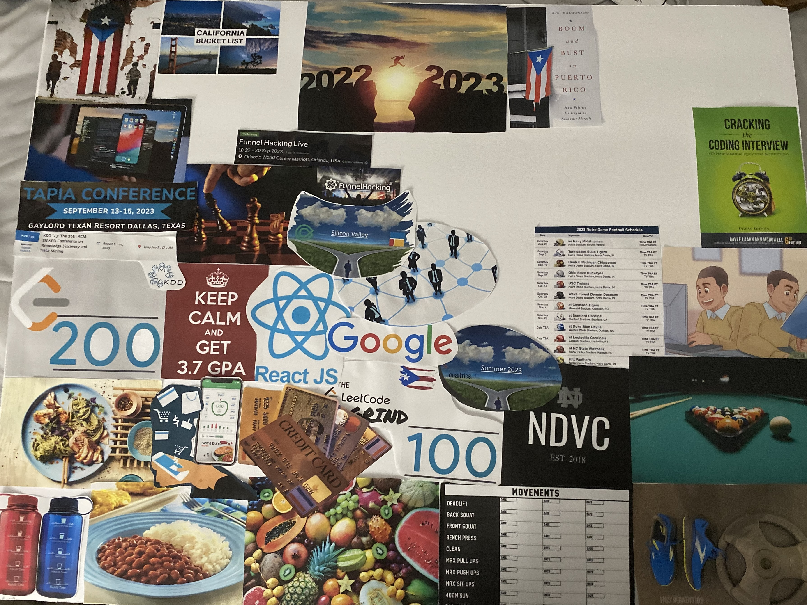
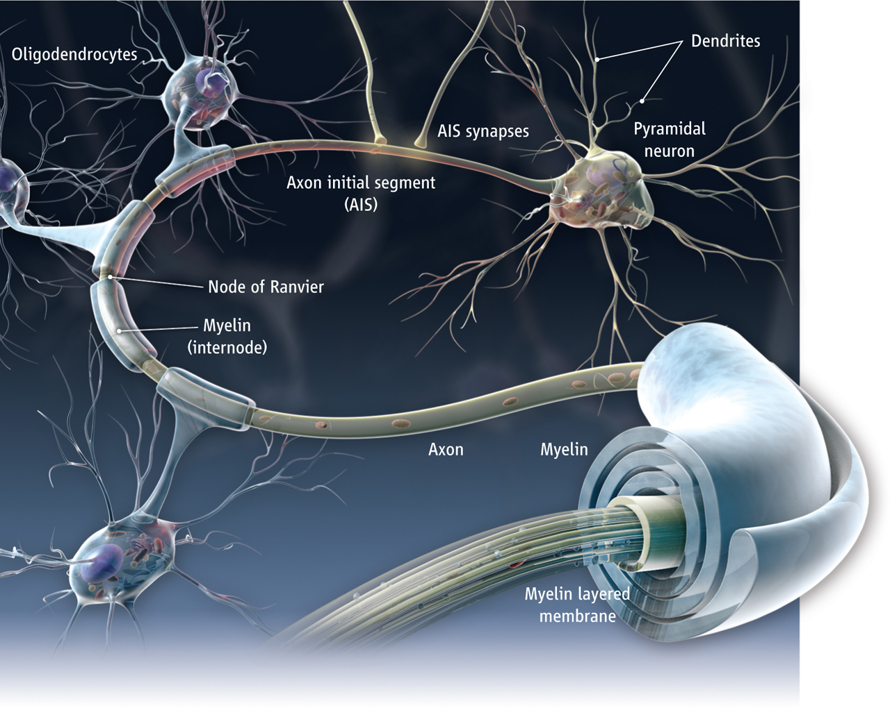
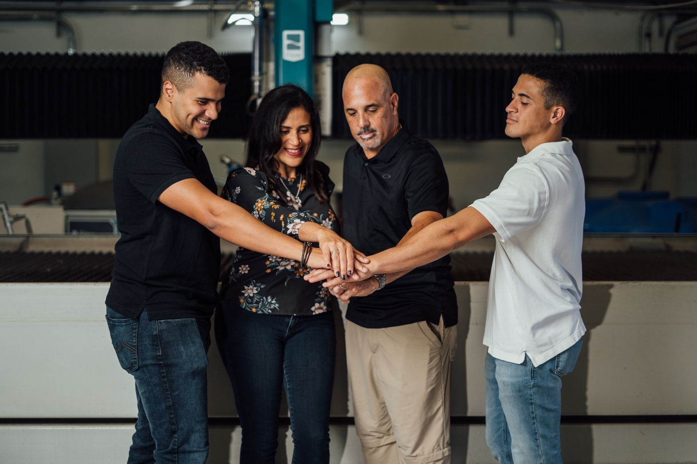
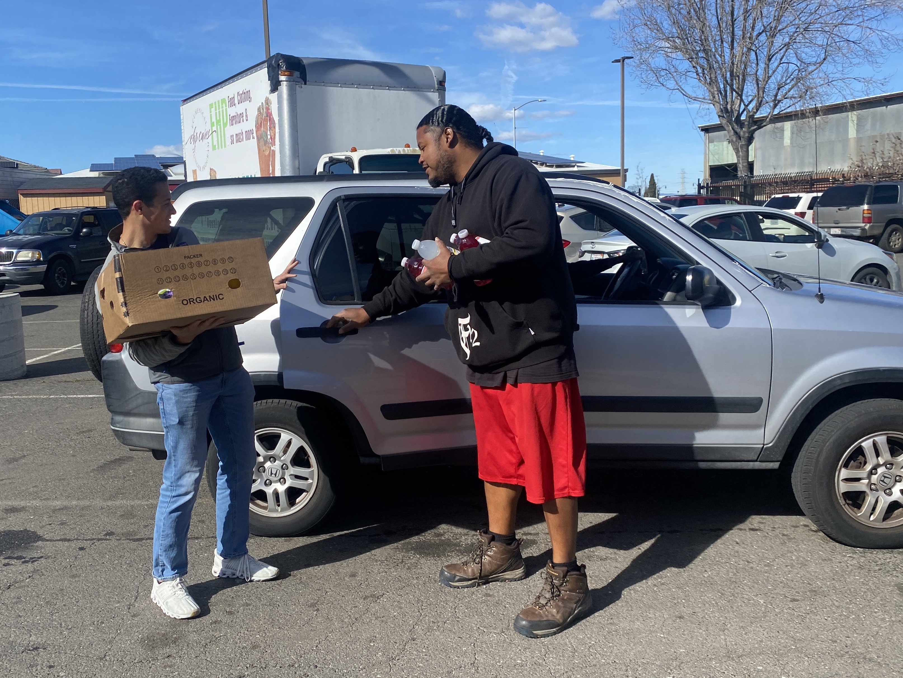
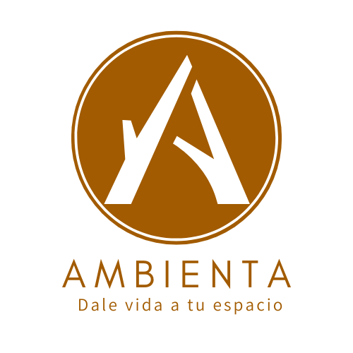

# Summer 2023

## Vision Board
Most of my summer in the year 2023 was spent in Puerto Rico, where I set multiple goals at the beginning of the year and worked towards them over the span of three months. Some of these goals included taking the GMAT, diving into the family business, creating a business of my own, contributing to the flourishing of a Silicon Valley startup, and acquiring as many skills as possible along the way.

## MBA Preparation
Being the foresighted, proactive individual that I am, I decided to take the GMAT well in advance. In my head, graduate school is a few years away, but feeling like I have one less thing to do calms me. I took the GMAT during the month of June. If you're interested in taking the GMAT, here's my advice:

- Buy the Official GMAT Guide and work through all of the problems in it. Eventually, the patterns in the problems will become clear, and you'll be able to solve them faster.
  - After you do a task enough times, myelin is formed around the neurons that are used to perform that task. This is called myelinization. It's the reason why you can drive a car without thinking about it or why you can type without looking at the keyboard.
    
- Take the GMATPrep practice tests. They are the most accurate representation of the real test.
- Start studying 3 months in advance. I studied 1 month in advance and wish I would've had more time to prepare.

## Benitez Metal
I also worked at the family business. I learned a lot about the business and how it operates. I also learned about the industry and the different players in it. It was extremely gratifying being able to contribute to the company that my parents built from the ground up and learn how to use the machinery. I specifically became proficient at operating the Flow Water Jet Cutter, a CNC machine used to cut any type of materials using abrasive and water that flows at extremely high pressures. Mastering AutoCAD also came along with the experience. My team focused mostly on organization and documentation. We created a NextJS app that allowed the quotation team to save previously estimated projects and be able to add new ones. So that if a new client comes with a certain idea, a quick quote can be assembled or searched for in no time. This was a great experience, and I'm grateful for the opportunity.

## Copia PBC
I had the pleasure and the opportunity to work with an amazing team of Software Engineers from all over the world at Copia PBC. I worked as a SWE Intern from January to August in a remote capacity. This experience was extremely enriching, and I learned a lot about Web Development and Systems Design. Some of the frameworks, languages, and concepts I learned during my time here include Docker, React, Redux, AWS, EC2, ECR, AWS Buckets, Agile Sprints, and many more.

I was able to contribute to the development of the Copia App, a React JS app that solves Poverty, Hunger, and Sustainability problems by coordinating the delivery between an entity (like supermarkets and restaurants) that find themselves with surplus food and wish to donate. I was also able to see in person the impact of my work as an engineer!

## Ambienta LLC
Last but not least, I had the pleasure of co-founding a company with Lucas Barreto, a Mechanical Engineer from Notre Dame and a good friend of mine. Together we created Ambienta LLC, a local Puerto Rican company specializing in the design and manufacture of interior and exterior art. We focus on precision-cut patterns and the highest quality finishes. Our products include lamps, decorative panels, and custom mirrors that aim to bring spaces to life using light and curves to provide a unique experience to our clientele. The creation of my first business was an extremely insightful experience that I will definitely leverage in the future when starting other ventures.

  - 
  - [Ambienta Catalogo](./catalogo.pdf)
